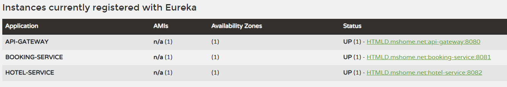
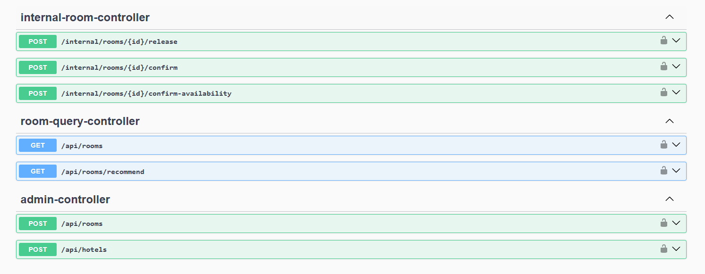

# Hotel Booking System

Pet‑проект микросервисной системы для бронирования отелей и номеров.  
Архитектура построена на Spring Boot + Spring Cloud.

## Архитектура

Система состоит из следующих сервисов:

- **eureka-server** — сервис регистрации (Service Discovery)
- **api-gateway** — единая точка входа (Spring Cloud Gateway)
- **booking-service** — бронирование номеров
- **hotel-service** — управление отелями и номерами

Все сервисы регистрируются в **Eureka** и взаимодействуют друг с другом через Gateway.

---

## Как запустить систему

### 1. Требования

- Java **21**
- Maven **3.9+**
- Свободные порты:
    - `8761` — Eureka
    - `8080` — API Gateway
    - `8081` — Booking Service
    - `8082` — Hotel Service

### 2. Сборка проекта

В корне проекта:

```bash
mvn clean install
```
### 3. Запуск сервисов (рекомендуемый порядок)
```bash   
cd eureka-server
   mvn spring-boot:run
   ```
```bash
   cd api-gateway
   mvn spring-boot:run
   ```
```bash
   cd hotel-service
   mvn spring-boot:run
   ```
```bash
   cd booking-service
   mvn spring-boot:run
   ```
### 4. Проверка Eureka
   Откройте в браузере:
```link
http://localhost:8761
```
Все сервисы должны быть в статусе UP.


### 5. Аутентификация
Используется JWT Bearer Token.

Алгоритм:
* Регистрация пользователя
* Аутентификация (получение JWT)
* Передача токена в Authorization header

Authorization: Bearer <JWT_TOKEN>
### 6. API Gateway
Все запросы выполняются через:
```link
http://localhost:8080
```
### 7. Поддерживаемые эндпойнты


### 8. Как протестировать
1. Swagger UI
   Swagger доступен напрямую у сервисов:

    Booking Service
    ```link
    http://localhost:8081/swagger-ui.html
    ```
    Hotel Service
    ```link
    http://localhost:8082/swagger-ui.html
    ```
2. Postman / HTTP Client

   Пример запроса с токеном:
    ```link
    GET http://localhost:8080/bookings
    Authorization: Bearer <JWT_TOKEN>
    ```
### 9. Технологии
* Java 21
* Spring Boot
* Spring Cloud (Eureka, Gateway)
* Spring Security + JWT
* Spring Data JPA
* H2 Database
* Flyway
* Resilience4j
* Lombok
* OpenAPI / Swagger

JWT‑секрет хранится в application.properties (для демо)